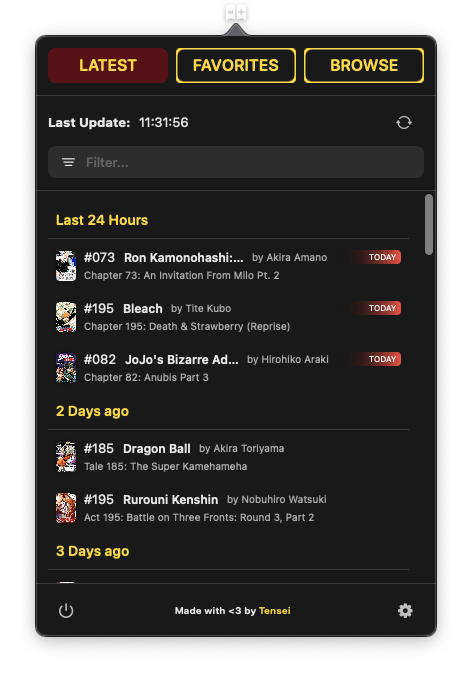

# MangaMenu Updates

MangaMenu is a macOS menubar app that regularly checks [MangaPlus](https://mangaplus.shueisha.co.jp/updates) for updates to your favorite manga and notifies you if there are any.

Download the latest version [here](https://github.com/tensei/MangaMenu-public/releases/latest).

# Features

* See latest chapters
* Manage your favorites
* Show manga Details
* Open chapters in your browser
* Notifications on new chapters

# Screenshots

<table>
    <tr>
        <td>
            
        </td>
        <td>
            
        </td>
        <td>
            
        </td>
    </tr>
    <tr>
        <td>
            
        </td>
        <td>
            
        </td>
    </tr>
</table>

# Changelog 
    v1.1 build 32
    - Fix: Details not loading on some Manga
    
    v1.1 build 31
    - Fix: Memory leak
    - Fix: Latest manga not showing sometimes

    v1.0 build 21
    - Added: Clicking on notification to open Chapter in Browser
    - Added: buymeacoffee button :)
    - Renamed: ALL to BROWSE

    v1.0 build 20
    - Added: You can now click on the manga cover in Latest to open the manga detail view
    - various bug fixes

    v1.0 build 18
    - Initial release
